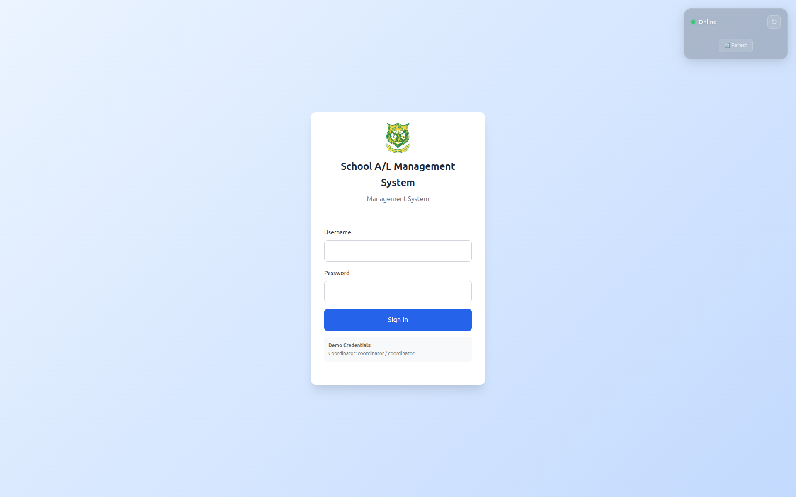
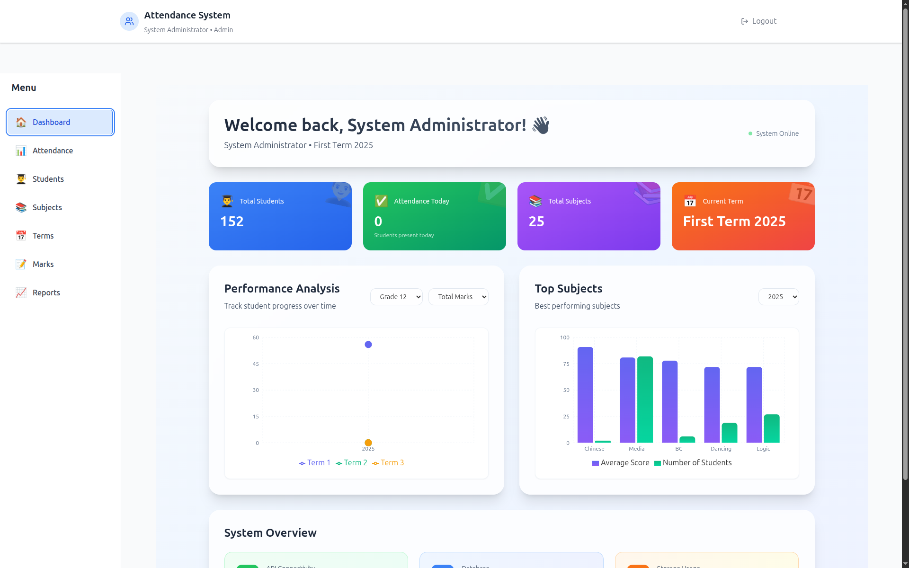
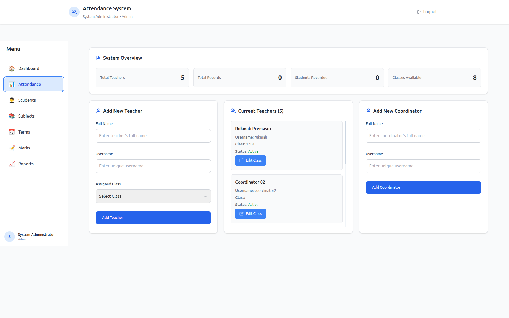
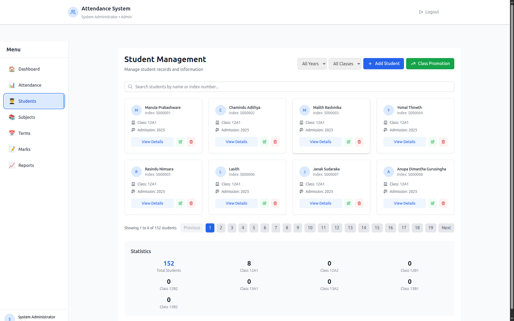
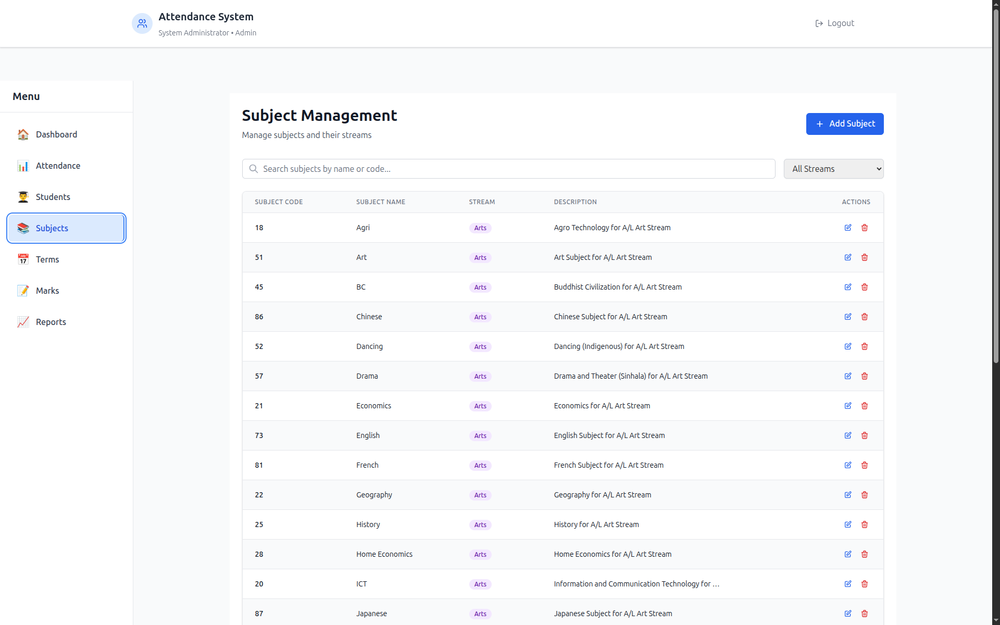
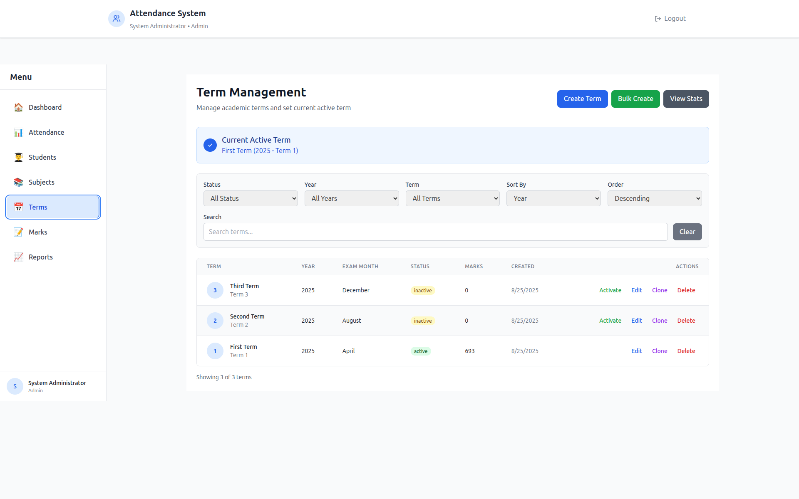
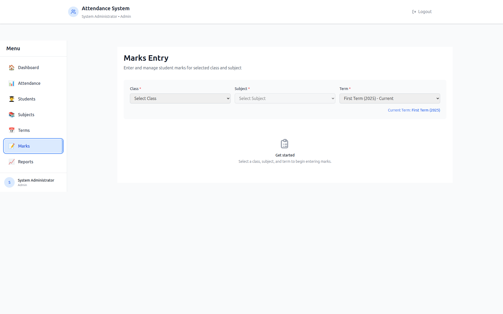
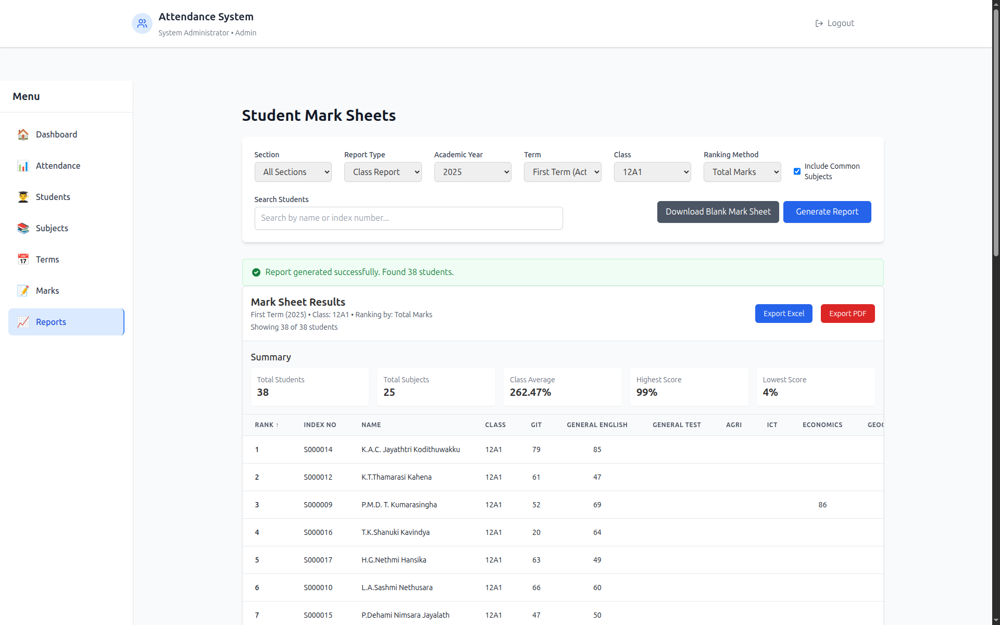

# 📘 School A/L Management System

A modern, role-based Attendance Management System developed using React, Node.js, Express, and PostgreSQL. This system is tailored for the Sri Lanka School Certificate (SCC) Advanced Level (A/L) Art Section, enabling efficient management of daily student attendance records.

---

## 🚀 Features

- **Role-Based Access**: Distinct roles for Teachers, Coordinators, and Admins to manage attendance and related tasks.
- **Daily Attendance Tracking**: Facilitates the recording of student attendance on a daily basis.
- **Responsive Design**: Ensures a seamless experience across various devices.
- **Secure Authentication**: Implemented using JWT for secure user sessions.
- **Real-Time Updates**: Utilizes WebSockets for live attendance updates.

---

## 🛠️ Tech Stack

- **Frontend**: React, Tailwind CSS
- **Backend**: Node.js, Express
- **Database**: PostgreSQL
- **Authentication**: JWT (JSON Web Tokens)
- **Password Encryption**: Node.js `crypto` module
- **Real-Time Communication**: Socket.io

---

## 📸 Screenshot

Login


Dashboard


Admin Attendece


Student Management


Subject Management


Term Management


Marks Management


Report Management


---

## 📦 Installation & Setup

### 1. Clone the Repository

```bash
git clone https://github.com/umyanga2005/School-AL-Management-System.git
cd School-AL-Management-System
```

### 2. Install Backend Dependencies

```bash
cd backend
npm install
```

### 3. Set Up Environment Variables

Create a `.env` file in the `backend` directory and configure the following variables:

```
DB_HOST=localhost
DB_PORT=5432
DB_USER=your_username
DB_PASSWORD=your_password
DB_NAME=school_al_management
JWT_SECRET=your_jwt_secret
```

---

### ⚠️ Important: Database & User Setup

Before starting the project:

1. **Create the Database and Tables**  
   Make sure your PostgreSQL database is created and all necessary tables (`users`, `attendance`, `roles`, etc.) exist. Refer to the `Tables schem.txt` file in the repository for details.

2. **Add Users Data**  
   Add at least one user for each role (Teacher, Coordinator, Admin) into the `users` table **before logging in**.

3. **Password Encryption**  
   Passwords must be stored encrypted using Node.js `crypto` module. Example:

```javascript
const crypto = require('crypto');

function encryptPassword(password) {
  return crypto.createHash('sha256').update(password).digest('hex');
}

// Example usage
const hashedPassword = encryptPassword('yourPasswordHere');
```

Insert the `hashedPassword` into the `password` field in the `users` table.

---

### 4. Start the Backend Server

```bash
npm start
```

### 5. Install Frontend Dependencies

```bash
cd ../frontend
npm install
```

### 6. Start the Frontend Server

```bash
npm start
```

The application should now be running on `http://localhost:3000`.

---

## 📄 Database Schema

```bash
create table public.attendance (
  id serial not null,
  teacher_id integer not null,
  date date not null,
  class character varying(50) not null,
  boys_count integer null default 0,
  girls_count integer null default 0,
  created_at timestamp without time zone null default CURRENT_TIMESTAMP,
  updated_at timestamp without time zone null default CURRENT_TIMESTAMP,
  constraint attendance_pkey primary key (id),
  constraint attendance_id_key unique (id),
  constraint fk_teacher foreign KEY (teacher_id) references users (id) on delete CASCADE
) TABLESPACE pg_default;

create table public.class_promotions (
  id serial not null,
  student_id integer not null,
  from_class character varying(10) not null,
  to_class character varying(10) not null,
  academic_year integer not null,
  promotion_date timestamp without time zone null default now(),
  constraint class_promotions_pkey primary key (id),
  constraint class_promotions_student_id_fkey foreign KEY (student_id) references students (id)
) TABLESPACE pg_default;

create table public.class_subjects (
  id serial not null,
  class_name character varying(20) not null,
  subject_id integer not null,
  academic_year integer not null,
  status character varying(20) null default 'active'::character varying,
  created_at timestamp without time zone null default now(),
  updated_at timestamp without time zone null default now(),
  constraint class_subjects_pkey primary key (id),
  constraint class_subjects_class_name_subject_id_academic_year_key unique (class_name, subject_id, academic_year),
  constraint class_subjects_subject_id_fkey foreign KEY (subject_id) references subjects (id)
) TABLESPACE pg_default;

create table public.marks (
  id serial not null,
  student_id integer not null,
  subject_id integer not null,
  term_id integer not null,
  marks numeric(5, 2) not null,
  teacher_id integer not null,
  entry_date timestamp without time zone null default now(),
  status character varying(20) null default 'active'::character varying,
  created_at timestamp without time zone null default now(),
  updated_at timestamp without time zone null default now(),
  constraint marks_pkey primary key (id),
  constraint marks_student_id_subject_id_term_id_key unique (student_id, subject_id, term_id),
  constraint marks_student_id_fkey foreign KEY (student_id) references students (id),
  constraint marks_subject_id_fkey foreign KEY (subject_id) references subjects (id),
  constraint marks_teacher_id_fkey foreign KEY (teacher_id) references users (id),
  constraint marks_marks_check check (
    (
      (marks >= (0)::numeric)
      and (marks <= (100)::numeric)
    )
  )
) TABLESPACE pg_default;

create table public.student_subjects (
  id serial not null,
  index_number character varying(50) not null,
  subject_id integer not null,
  academic_year integer not null,
  assigned_date timestamp without time zone null default now(),
  created_at timestamp without time zone null default now(),
  updated_at timestamp without time zone null default now(),
  constraint student_subjects_pkey primary key (id),
  constraint student_subjects_index_number_subject_id_academic_year_key unique (index_number, subject_id, academic_year),
  constraint student_subjects_index_number_fkey foreign KEY (index_number) references students (index_number),
  constraint student_subjects_subject_id_fkey foreign KEY (subject_id) references subjects (id)
) TABLESPACE pg_default;

create index IF not exists idx_student_subjects_index_number on public.student_subjects using btree (index_number) TABLESPACE pg_default;

create index IF not exists idx_student_subjects_subject_id on public.student_subjects using btree (subject_id) TABLESPACE pg_default;

create index IF not exists idx_student_subjects_academic_year on public.student_subjects using btree (academic_year) TABLESPACE pg_default;

create trigger update_student_subjects_updated_at BEFORE
update on student_subjects for EACH row
execute FUNCTION update_updated_at_column ();

create table public.students (
  id serial not null,
  index_number character varying(50) not null,
  name character varying(255) not null,
  address text null,
  mother_name character varying(255) null,
  father_name character varying(255) null,
  guardian_name character varying(255) null,
  mother_phone character varying(20) null,
  father_phone character varying(20) null,
  guardian_phone character varying(20) null,
  current_class character varying(10) not null,
  admission_year integer not null,
  status character varying(20) null default 'active'::character varying,
  created_at timestamp without time zone null default now(),
  updated_at timestamp without time zone null default now(),
  name_with_initials character varying(255) null,
  constraint students_pkey primary key (id),
  constraint students_index_number_key unique (index_number),
  constraint unique_index_number unique (index_number)
) TABLESPACE pg_default;


create table public.subjects (
  id serial not null,
  subject_code character varying(20) not null,
  subject_name character varying(255) not null,
  stream character varying(50) not null,
  description text null,
  status character varying(20) null default 'active'::character varying,
  created_at timestamp without time zone null default now(),
  updated_at timestamp without time zone null default now(),
  constraint subjects_pkey primary key (id),
  constraint subjects_subject_code_key unique (subject_code)
) TABLESPACE pg_default;

create table public.terms (
  id serial not null,
  term_number integer not null,
  term_name character varying(100) not null,
  exam_month integer not null,
  exam_year integer not null,
  status character varying(20) null default 'inactive'::character varying,
  created_at timestamp without time zone null default now(),
  updated_at timestamp without time zone null default now(),
  constraint terms_pkey primary key (id),
  constraint terms_term_number_exam_year_key unique (term_number, exam_year),
  constraint terms_exam_month_check check (
    (
      (exam_month >= 1)
      and (exam_month <= 12)
    )
  ),
  constraint terms_term_number_check check (
    (
      (term_number >= 1)
      and (term_number <= 3)
    )
  )
) TABLESPACE pg_default;

create table public.users (
  id serial not null,
  username character varying(255) not null,
  password_hash text null,
  role character varying(50) not null,
  full_name character varying(255) null,
  assigned_class character varying(100) null,
  temp_password boolean null default false,
  created_at timestamp without time zone null default CURRENT_TIMESTAMP,
  updated_at timestamp with time zone null,
  constraint users_pkey primary key (id),
  constraint users_username_key unique (username)
) TABLESPACE pg_default;


// First, let's add the class_reports table to the database schema
// Add this to Tables schem.txt

create table public.class_reports (
  id serial not null,
  academic_year integer not null,
  term_id integer not null,
  class_name character varying(50) not null,
  calculation_method character varying(50) not null,
  report_data jsonb not null,
  generated_by integer not null,
  generated_at timestamp without time zone null default now(),
  created_at timestamp without time zone null default now(),
  updated_at timestamp without time zone null default now(),
  constraint class_reports_pkey primary key (id),
  constraint class_reports_generated_by_fkey foreign KEY (generated_by) references users (id),
  constraint class_reports_term_id_fkey foreign KEY (term_id) references terms (id)
) TABLESPACE pg_default;

create index IF not exists idx_class_reports_class on public.class_reports using btree (class_name) TABLESPACE pg_default;

create index IF not exists idx_class_reports_year on public.class_reports using btree (academic_year) TABLESPACE pg_default;

create index IF not exists idx_class_reports_term on public.class_reports using btree (term_id) TABLESPACE pg_default;

create index IF not exists idx_class_reports_generated_by on public.class_reports using btree (generated_by) TABLESPACE pg_default;

```

---

## 📄 License

This project is licensed under the MIT License.

---

